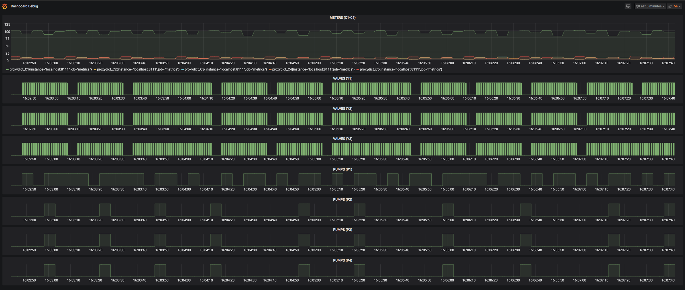

## Uruchomienie (uklad sterowania)

Aby system dzialal prawidlowo nalezy odpalic dwa osobne komponenty:
(a) _hardware_ - czyli komunikacja I/O z zawarami i czujnikami
(b) _control/main_ - czyli jak manipulowac I/O aby osiagnac dany stan

Dlatego najpierw musimy odpalic _hardware_:

```bash
pi@local $ python3 realhardware.py # hardware I/O
albo
$ python3 hardware.py # (simulated) hardware I/O
```

A pozniej skrypt sterujacy (_control_):

```bash
pi@local $ python3 main.py         # to steer the ship ;-)
```

Gdy spojrzymy na zawartosc pliku `realhardware.py` zobaczymy ze mamy tam API
ktore pozwala na zczytywanie stanow oraz wysylanie rozkazow.
Natomiast w pliku `core/api.py` mamy analogiczna sytuacje tylko ze dla ukladu
sterowania.

---

## Inspekcja (dodatkowy krok)



Aby uzyskac _dashboard_ taki jak u gory nalezy z innego urzadzenia polaczyc sie
z naszym systemem sterowania.

Potrzebne beda potrzebne dodatkowe pakiety:

```bash
$ brew install grafana     # odpalamy na swoim komputerze (dashboardy/wykresy)
pi@local $ brew install prometheus  # odpalamy na ukladzie sterowania (baza danych)
```

Na swoim komputerze nalezy odpalic _Grafana_ oraz wczytac plik `grafana.json`:

```bash
$ grafana-server --config=/usr/local/etc/grafana/grafana.ini --homepath /usr/local/share/grafana --packaging=brew cfg:default.paths.logs=/usr/local/var/log/grafana cfg:default.paths.data=/usr/local/var/lib/grafana cfg:default.paths.plugins=/usr/local/var/lib/grafana/plugins
```

A na ukladzie sterowania nalezy wlaczyc zapisywanie do bazy czyli:

```
pi@local $ prometheus
```
